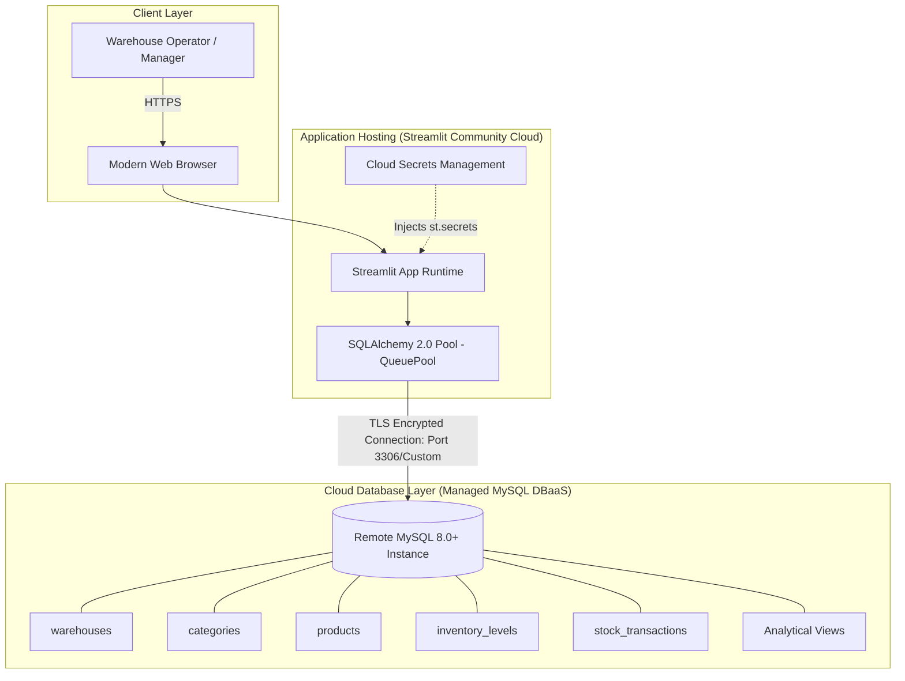

# 🚀 Production Deployment Playbook: Streamlit Community Cloud + Managed MySQL DBaaS

This guide walks through the end-to-end deployment of the **Cloud-Based Multi-Warehouse Inventory Management System** using **Streamlit Community Cloud** and a managed **MySQL Database-as-a-Service (DBaaS)** (Aiven or Railway).

---

## 📋 Architecture Overview



---

## 🛠️ Step 1: Provision a Free Remote MySQL DBaaS Instance

Choose either **Option A (Aiven)** or **Option B (Railway)**. Both offer free tiers or trials without requiring upfront credit card commitments.

### Option A: Aiven for MySQL (Recommended)

1. **Sign Up**: Navigate to [aiven.io](https://aiven.io) and register for a free account.
2. **Create New Service**:
   - Click **Create Service**.
   - Select **MySQL** (version 8.0+).
   - Select Cloud Provider (e.g. AWS or Google Cloud).
   - Select your nearest Region (e.g. `us-east-1` or `europe-west1`).
   - Select the **Free Plan** or **Startup Plan**.
   - Set Service Name to `inventory-mysql-prod`.
   - Click **Create Service**.
3. **Retrieve Connection Parameters**:
   - In the service **Overview** page, locate **Connection Information**:
     - **Host**: e.g. `mysql-29a1b-mycompany.aivencloud.com`
     - **Port**: e.g. `13452`
     - **User**: `avnadmin`
     - **Password**: *(Click to reveal and copy)*
     - **Database / Service Database**: `defaultdb` (or create `inventory_db` under the Databases tab)
     - **SSL**: Download the `ca.pem` certificate bundle if enforcing strict CA verification.

---

### Option B: Railway for MySQL

1. **Sign Up**: Navigate to [railway.app](https://railway.app) and sign in using your GitHub account.
2. **Provision Database**:
   - Click **New Project** -> **Provision MySQL**.
   - Railway will instantiate a dedicated MySQL container within 30 seconds.
3. **Retrieve Connection Parameters**:
   - Click on the provisioned **MySQL service tile**.
   - Navigate to the **Variables** or **Connect** tab.
   - Collect the following generated connection parameters:
     - `MYSQLHOST` (e.g. `viaduct.proxy.rlwy.net`)
     - `MYSQLPORT` (e.g. `28190`)
     - `MYSQLDATABASE` (usually `railway`)
     - `MYSQLUSER` (usually `root`)
     - `MYSQLPASSWORD` (e.g. `kY9b...`)

---

## 🗄️ Step 2: Initialize Database Schema & Seed Data

Once your remote database is active, apply the DDL schema and load initial inventory balances.

### Method 1: Automated Python Runner (Recommended)

Configure your `.streamlit/secrets.toml` locally with your new remote DB credentials, then run the automated initialization tool:

```bash
# Run the automated database migration script
py -3.11 scripts/init_db.py
```

This script automatically verifies connectivity, creates all InnoDB tables with check constraints and views from [`database/schema.sql`](file:///c:/Users/rithikesh%2077/Downloads/RK%20Projects/Cloud%20Computing/Cloud-Based%20Multi-Warehouse%20Inventory%20Management%20System/database/schema.sql), and populates 3 warehouses, 5 categories, 15 SKUs, and initial transaction ledgers from [`database/seed_data.sql`](file:///c:/Users/rithikesh%2077/Downloads/RK%20Projects/Cloud%20Computing/Cloud-Based%20Multi-Warehouse%20Inventory%20Management%20System/database/seed_data.sql).

---

### Method 2: MySQL CLI

You can execute the SQL files directly using the native MySQL command-line client:

```bash
# 1. Apply Schema DDL
mysql -h <HOST> -P <PORT> -u <USER> -p <DATABASE> < database/schema.sql

# 2. Insert Seed Data
mysql -h <HOST> -P <PORT> -u <USER> -p <DATABASE> < database/seed_data.sql
```

---

### Method 3: Cloud Web Console / Database Client (DBeaver, TablePlus)

1. Open your database GUI (DBeaver, TablePlus, or MySQL Workbench).
2. Create a new MySQL Connection using the credentials gathered in Step 1.
3. Set **SSL Mode** to `Required` or `Verify-CA`.
4. Open an SQL Editor window, paste the contents of `database/schema.sql`, and execute.
5. Open a second SQL Editor window, paste the contents of `database/seed_data.sql`, and execute.

---

## 🐙 Step 3: Push Repository to GitHub

Ensure that local secrets (`.streamlit/secrets.toml`, `.env`, certificates) are excluded via `.gitignore`.

```bash
# Initialize git repository (if not already done)
git init

# Stage all project files
git add .

# Verify that .streamlit/secrets.toml is NOT staged
git status

# Commit changes
git commit -m "feat: complete production multi-warehouse inventory management system"

# Rename branch to main
git branch -M main

# Link to your remote GitHub repository
git remote add origin https://github.com/<YOUR_GITHUB_USERNAME>/<YOUR_REPO_NAME>.git

# Push to GitHub
git push -u origin main
```

---

## ☁️ Step 4: Link GitHub Repository to Streamlit Community Cloud

1. Log into **[share.streamlit.io](https://share.streamlit.io)** using your GitHub credentials.
2. Click **Create app** (or **New app** in the top right).
3. Fill in the deployment details:
   - **Repository**: `<YOUR_GITHUB_USERNAME>/<YOUR_REPO_NAME>`
   - **Branch**: `main`
   - **Main file path**: `app.py`
   - **App URL (optional)**: e.g. `multi-warehouse-inventory.streamlit.app`
4. Do **not** click Deploy immediately; proceed to Step 5 to configure secrets first, or click Deploy and configure secrets while the build finishes.

---

## 🔐 Step 5: Inject Production Credentials into Streamlit Cloud Secrets

1. In your Streamlit Cloud dashboard, click on the **App Settings** (three dots menu next to your app -> **Settings**).
2. In the left navigation pane, select **Secrets**.
3. Paste the following TOML configuration block, substituting your live DBaaS parameters:

```toml
[mysql]
host = "your-remote-mysql-host.region.provider.com"
port = 3306
database = "inventory_db"
user = "avnadmin"
password = "your-secure-production-password"

# Connection Pooling Settings for Cloud Concurrency
pool_size = 10
max_overflow = 20
pool_timeout = 30
pool_recycle = 3600

# SSL / TLS Settings
ssl_verify_cert = false
ssl_ca = ""

# Streamlit Native Connections Format (Compatibility)
[connections.mysql]
dialect = "mysql"
driver = "pymysql"
host = "your-remote-mysql-host.region.provider.com"
port = 3306
database = "inventory_db"
username = "avnadmin"
password = "your-secure-production-password"
query = { charset = "utf8mb4" }
```

4. Click **Save**. Streamlit Community Cloud will automatically detect the updated secrets and reload the running application container.

---

## ✅ Step 6: Post-Deployment Verification & Health Checks

Conduct the following end-to-end verification checklist to validate system integrity in production:

| Verification Test | Location in UI | Expected Result | Pass/Fail |
| :--- | :--- | :--- | :--- |
| **1. DBaaS Health Check** | Sidebar | Displays `🟢 DB Connected: MySQL 8.x.x` and database name | [ ] |
| **2. KPI Cards Aggregation** | Header | Displays Total Valuation (`$248k+`), Total Physical Units, Active Facilities (`3`), and Low Stock Alerts (`12`) | [ ] |
| **3. Inventory Catalog Filtering** | Tab 1: Real-Time Overview | Filter by "Pacific Northwest Facility (Seattle)" and Category "Sensors & Automation Controls". Verifies on-hand balances load cleanly. | [ ] |
| **4. Inbound Restock Mutation** | Tab 2: Stock Operations | Restock 20 units of `FST-HEX-M12-100` at Dallas. Verifies green success toast `Restocked +20 units!` and instant balance increment. | [ ] |
| **5. ACID Outbound Dispatch Check** | Tab 2: Stock Operations | Dispatch 5 units of `PPE-RESP-N95-FLT`. Verifies balance decreases and transaction reference logs in database. | [ ] |
| **6. Deficit Rollback Test** | Tab 2: Stock Operations | Attempt to dispatch **99,999 units** of any item. Verifies application catches `InsufficientStockError`, displays red rejection banner, and rolls back cleanly without data corruption. | [ ] |
| **7. Atomic Inter-Warehouse Transfer** | Tab 3: Transfers | Transfer 10 units of `PKG-THRM-PAL-CVR` from Dallas (surplus) to Chicago (depleted). Verifies source drops by 10 and destination increases by 10. | [ ] |
| **8. Demand Forecasting Plotly Curves** | Tab 4: Demand Analytics | Select an item; verifies 30-day historical consumption trend and 14-day depletion curve render with dashed horizontal lines for Reorder Point and Safety Stock. | [ ] |
| **9. Audit Trail & CSV Export** | Tab 5: Audit Ledger | Search for recent transaction by Reference ID; click **📥 Export Ledger to CSV** and verify file downloads with valid CSV headers. | [ ] |

---

## 🛠️ Step 7: Cloud Troubleshooting Runbook

### Error: `OperationalError (1045, "Access denied for user ...")`
- **Cause**: Incorrect username, database name, or password in Streamlit Secrets.
- **Remedy**: Double-check secrets in **App Settings -> Secrets**. Note that Aiven uses `avnadmin` as default user, while Railway uses `root`.

### Error: `OperationalError (2003, "Can't connect to MySQL server")`
- **Cause**: Remote DBaaS firewall blocking incoming connections from Streamlit Community Cloud IPs.
- **Remedy**:
  - In Aiven: Service -> **IP Allowlist** -> Ensure `0.0.0.0/0` is allowed (or specify Streamlit Cloud NAT IP ranges).
  - In Railway: Ensure you are connecting via the **Public TCP Proxy Domain** (`viaduct.proxy.rlwy.net`), not the internal private network domain (`mysql.railway.internal`).

### Error: `SSLError: [SSL: CERTIFICATE_VERIFY_FAILED]`
- **Cause**: Strict TLS certificate chain verification failed on client side.
- **Remedy**: In `.streamlit/secrets.toml` or Streamlit Secrets, verify `ssl_verify_cert = false`. Encrypted TLS transmission remains active without requiring manual CA trust store bundle mounts.

### Error: `MySQL server has gone away`
- **Cause**: Remote cloud load balancer dropped idle TCP socket.
- **Remedy**: The application includes dynamic pooling in [`utils/db_handler.py`](file:///c:/Users/rithikesh%2077/Downloads/RK%20Projects/Cloud%20Computing/Cloud-Based%20Multi-Warehouse%20Inventory%20Management%20System/utils/db_handler.py) with `pool_recycle=3600` and `pool_pre_ping=True`, which automatically detects severed sockets and re-establishes connections before query execution.
