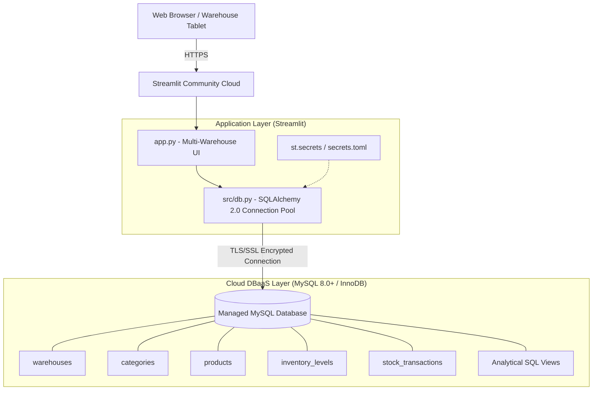

# 📦 Cloud-Based Multi-Warehouse Inventory Management System

A production-ready enterprise inventory management solution engineered for high availability and scalable cloud deployment. Built with **Streamlit Community Cloud** and a managed **MySQL Database-as-a-Service (DBaaS)** (AWS RDS, PlanetScale, Aiven, or Azure Database for MySQL).

---

## 🔗 Project Links

- 💻 **GitHub Repository:** [https://github.com/rithikesh18-rk/cloud-computing](https://github.com/rithikesh18-rk/cloud-computing)
- 🚀 **Attendance Management System — Live Demo:** [https://attendance-management-system-1-3fey.onrender.com/](https://attendance-management-system-1-3fey.onrender.com/)
- ☁️ **Cloud Inventory Orchestrator — Live Demo:** [https://rk-inventory-cloud.streamlit.app/](https://rk-inventory-cloud.streamlit.app/)

The application is deployed using Streamlit Community Cloud and currently supports Demo Mode with a mock inventory dataset. It demonstrates multi-warehouse inventory monitoring, stock alerts, warehouse operations, demand analytics, and transaction auditing.

---

## 🏛️ System Architecture



---

## 📁 Project Directory Structure

```text
Cloud-Based Multi-Warehouse Inventory Management System/
├── .gitignore                      # Python, Streamlit secrets, certificates & system excludes
├── requirements.txt                # Production dependencies (Streamlit, SQLAlchemy, PyMySQL, Plotly)
├── README.md                       # Comprehensive deployment and operations manual
├── app.py                          # Streamlit application entrypoint with KPIs, forms, and charts
│
├── .streamlit/
│   ├── config.toml                 # Dark-mode enterprise UI and server hardening
│   └── secrets.toml.example        # Cloud DBaaS connection credentials template
│
├── config/
│   └── secrets.example.toml        # Standalone config template for CLI/migration scripts
│
├── database/
│   ├── schema.sql                  # InnoDB DDL with foreign keys, check constraints & views
│   └── seed_data.sql               # Seed data (3 warehouses, 5 categories, 15 SKUs, alert states)
│
└── src/
    ├── __init__.py                 # Python package identifier
    ├── config.py                   # Centralized secrets loader with .env fallback
    └── db.py                       # Resilient pooled SQLAlchemy engine with pre-ping & TLS support
```

---

## 🗄️ Database Design (InnoDB Engine Standards)

### Relational Schema Design

1. **`warehouses`**: Tracks physical distribution facilities with unit storage capacities.
2. **`categories`**: Product taxonomy catalog with unique name constraints.
3. **`products`**: Central item master containing SKUs, pricing, safety stock, and reorder points.
4. **`inventory_levels`**: Composite key `(product_id, warehouse_id)` tracking on-hand inventory with strict `CHECK (quantity >= 0)` integrity guarantees.
5. **`stock_transactions`**: Immutable ledger recording all incoming and outgoing inventory events (`RESTOCK`, `DISPATCH`, `TRANSFER`, `ADJUSTMENT`) with reference tracking.
6. **Pre-computed Views**:
   - `v_inventory_overview`: Valuation and stock status (`HEALTHY`, `LOW_STOCK`, `CRITICAL`, `OUT_OF_STOCK`).
   - `v_low_stock_alerts`: Dynamic shortage alert prioritization.
   - `v_warehouse_utilization`: Storage density and utilization percentage per facility.

---

## 🚀 Quickstart & Local Setup

### 1. Prerequisites
- Python 3.10+
- Access to a MySQL 8.0+ instance (local or managed cloud DBaaS)

### 2. Virtual Environment Setup
```bash
# Clone the repository
git clone <your-repo-url>
cd "Cloud-Based Multi-Warehouse Inventory Management System"

# Create and activate virtual environment
python -m venv venv
# Windows:
.\venv\Scripts\activate
# Linux/macOS:
source venv/bin/activate

# Install dependencies
pip install -r requirements.txt
```

### 3. Database Initialization
Execute the schema and seed scripts using the MySQL CLI or your database GUI (MySQL Workbench, DBeaver, or cloud console):

```bash
# Apply schema DDL
mysql -u <username> -p -h <db-host> <database_name> < database/schema.sql

# Load realistic multi-warehouse seed dataset
mysql -u <username> -p -h <db-host> <database_name> < database/seed_data.sql
```

### 4. Configure Local Secrets
Copy `.streamlit/secrets.toml.example` to `.streamlit/secrets.toml`:

```bash
cp .streamlit/secrets.toml.example .streamlit/secrets.toml
```

Edit `.streamlit/secrets.toml` with your database credentials:
```toml
[mysql]
host = "your-dbaas-host.region.provider.com"
port = 3306
database = "inventory_db"
user = "admin_user"
password = "your-secure-dbaas-password"
ssl_verify_cert = false
```

### 5. Launch the Application
```bash
streamlit run app.py
```
Open your browser at `http://localhost:8501`.

---

## ☁️ Deployment to Streamlit Community Cloud

1. **Push to GitHub**:
   Ensure `.streamlit/secrets.toml` is **NOT** committed (verified via `.gitignore`).
   ```bash
   git add .
   git commit -m "feat: initial multi-warehouse inventory setup"
   git push origin main
   ```

2. **Deploy on Streamlit Cloud**:
   - Visit [share.streamlit.io](https://share.streamlit.io) and click **"New app"**.
   - Select your repository, branch (`main`), and set the main file path to `app.py`.

3. **Configure Cloud Secrets**:
   - In your app settings on Streamlit Cloud, navigate to **Settings** > **Secrets**.
   - Paste your MySQL credentials in TOML format:
     ```toml
     [mysql]
     host = "your-cloud-mysql-endpoint"
     port = 3306
     database = "inventory_db"
     user = "cloud_user"
     password = "your_secure_password"
     pool_size = 5
     max_overflow = 10
     pool_timeout = 30
     pool_recycle = 1800
     ssl_verify_cert = false
     ```

4. **Network & DBaaS Firewall (Allowlisting)**:
   - Ensure your cloud MySQL instance (AWS RDS, Aiven, GCP Cloud SQL) allows incoming traffic from Streamlit Community Cloud IPs (`0.0.0.0/0` with strong authentication or VPC peering/proxy).
